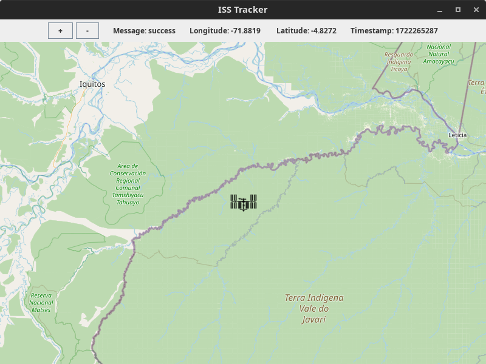

## Description
A simple, user-friendly application made in Java using Swing, JXMapViewer2, Nathan Bergey's [ISS-Now API](http://open-notify.org/), and FasterXML. The map is fixed at the last known position of the ISS, updates its location every 5 seconds, and includes zoom functionality for a closer view of the ISS's location. 




## Installation

#### Dependencies
[Oracle JDK](https://www.oracle.com/java/technologies/downloads/) or [AdoptOpenJDK](https://adoptium.net/)

[Maven](https://maven.apache.org/)

[JXMapViewer2](https://github.com/msteiger/jxmapviewer2)

[Jackson FasterXML](https://github.com/FasterXML/jackson)

### Linux Installation

#### 1. Install Java or Verify Installation

#### 2. Install Maven or Verify Installation

#### 3. Clone Repository
```bash
git clone https://github.com/AB1775/ISS-Tracker
cd /path/to/ISS-Tracker/
```
#### 4. Install Dependencies
```bash
mvn install
```

#### 5. Run the Application
```bash
java -jar target/ISS-Tracker-main/target/isstracker-1.0-SNAPSHOT-jar-with-dependencies.jar
```

### Windows Installation
#### 1. Install Java or Verify Installation
#### 2. Install Maven or Verify Installation

#### 5. Clone Repository
```cmd
git clone https://github.com/AB1775/ISS-Tracker
```
#### 6. Navigate to the Project Directory
```cmd
cd \path\to\ISS-Tracker\
```
#### 7. Build the Project
```cmd
mvn clean install
```
#### 8. Run the Application
```cmd
mvn exec:java -Dexec.MainClass="com.isstracker.Main"
```
